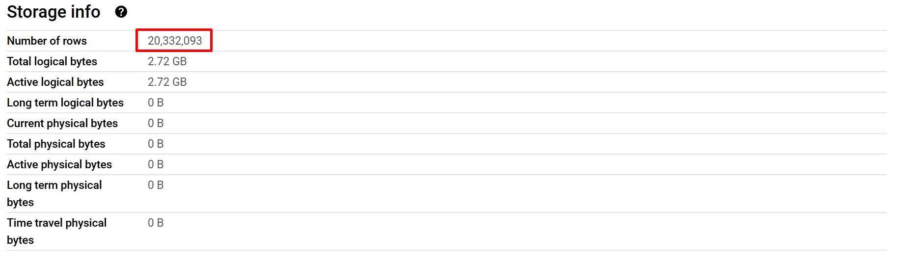

# BigQuery Google Cloud Platform - Homework Solution DE Zoomcamp 2025
## Project Overview
This repository is the resolution of the Week 3 homework for the Data Engineer Zoomcamp 2025. It demonstrates the use and analysis of queries in BigQuery on Google Cloud Platform (GCP).

The main focus is on the amount of data that GCP estimates for query execution, which is important because GCP calculates costs based on the data processed. Additionally, it highlights the differences between partitioning and clustering techniques.
## Data Preparation
### Ingest parquet files to GCS
To ingest Parquet files of NYC Taxi Data from January to June 2024 into GCS, a Python script is used, where the bucket name and the necessary credentials are set.
```bash
python load_yellow_taxi_data.py
```
### Create tables
```sql
-- Create a external table
CREATE OR REPLACE EXTERNAL TABLE `de-bigquery-w3.yellow_2024_dataset.external_yellow_tripdata`
OPTIONS (
  format = 'PARQUET',
  uris = ['gs://de-bigquery-w3-gcs/yellow_tripdata_2024-01.parquet', 'gs://de-bigquery-w3-gcs/yellow_tripdata_2024-02.parquet', 'gs://de-bigquery-w3-gcs/yellow_tripdata_2024-03.parquet', 'gs://de-bigquery-w3-gcs/yellow_tripdata_2024-04.parquet', 'gs://de-bigquery-w3-gcs/yellow_tripdata_2024-05.parquet', 'gs://de-bigquery-w3-gcs/yellow_tripdata_2024-06.parquet']
);

-- Create a materialized non partitioned table from external table
CREATE OR REPLACE TABLE de-bigquery-w3.yellow_2024_dataset.yellow_tripdata_non_partitoned AS
SELECT * FROM de-bigquery-w3.yellow_2024_dataset.external_yellow_tripdata;
```
## Solution
### Question 1
What is count of records for the 2024 Yellow Taxi Data?

The count is **20,332,093**. Details of (regular/materialized) table
### Question 2
Write a query to count the distinct number of PULocationIDs for the entire dataset on both the tables.
What is the estimated amount of data that will be read when this query is executed on the External Table and the Table?
```sql
-- External table
SELECT COUNT(DISTINCT PULocationID) FROM de-bigquery-w3.yellow_2024_dataset.external_yellow_tripdata;
```
This query will **process 0 B** when run on external table
```sql
-- Regular table
SELECT COUNT(DISTINCT PULocationID) FROM de-bigquery-w3.yellow_2024_dataset.yellow_tripdata_non_partitoned;
```
This query will **process 155.12** MB when run on regular table
### Question 3
Write a query to retrieve the PULocationID from the table (not the external table) in BigQuery. Now write a query to retrieve the PULocationID and DOLocationID on the same table. Why are the estimated number of Bytes different?
```sql
SELECT PULocationID FROM de-bigquery-w3.yellow_2024_dataset.yellow_tripdata_non_partitoned;
```
This query will **process 155.12 MB** when run.
```sql
SELECT PULocationID, DOLocationID FROM de-bigquery-w3.yellow_2024_dataset.yellow_tripdata_non_partitoned;
```
This query will **process 310.24 MB** when run.

BigQuery is a columnar database, and it only scans the specific columns requested in the query. Querying two columns (PULocationID, DOLocationID) requires reading more data than querying one column (PULocationID), leading to a higher estimated number of bytes processed.
### Question 4
How many records have a fare_amount of 0?
```sql
SELECT COUNT(1) FROM de-bigquery-w3.yellow_2024_dataset.yellow_tripdata_non_partitoned WHERE fare_amount = 0;
```
**8,333 records**
### Question 5
What is the best strategy to make an optimized table in Big Query if your query will always filter based on tpep_dropoff_datetime and order the results by VendorID

The best strategy always depends on how we query the table. In this case is **partition by tpep_dropoff_datetime and Cluster on VendorID**.
### Question 6
Write a query to retrieve the distinct VendorIDs between tpep_dropoff_datetime 2024-03-01 and 2024-03-15 (inclusive)

Use the materialized table you created earlier in your from clause and note the estimated bytes. Now change the table in the from clause to the partitioned table you created for question 5 and note the estimated bytes processed. What are these values?
```sql
-- Non partitioned table
SELECT DISTINCT VendorID FROM de-bigquery-w3.yellow_2024_dataset.yellow_tripdata_non_partitoned WHERE DATE(tpep_dropoff_datetime) > '2024-03-01' AND DATE(tpep_dropoff_datetime) <= '2024-03-15';
```
This query will **process 310.24 MB** when run.
```sql
-- Partitioned and clustered table
SELECT DISTINCT VendorID FROM de-bigquery-w3.yellow_2024_dataset.yellow_tripdata_partitoned_clustered WHERE DATE(tpep_dropoff_datetime) > '2024-03-01' AND DATE(tpep_dropoff_datetime) <= '2024-03-15';
```
This query will **process 25.05 MB** when run.
### Question 7
Where is the data stored in the External Table you created?
Is stored in **GCP Bucket**.
### Question 8
It is best practice in Big Query to always cluster your data:
**False**
### Question 9
Write a SELECT count(*) query FROM the materialized table you created. How many bytes does it estimate will be read? Why?
```sql
SELECT count(*) FROM de-bigquery-w3.yellow_2024_dataset.yellow_tripdata_non_partitoned
```
This query will **process 0 MB** when run.

BigQuery is optimized to handle certain aggregation functions like COUNT(*) without scanning the actual data. In this case, BigQuery does not query the regular table; instead, it reads the table metadata for better performance.
## Conclusion
This repository provides a detailed solution for the Week 3 homework of the Data Engineer Zoomcamp 2025, demonstrating BigQuery's capabilities on Google Cloud Platform. Through various queries, it highlights the impact of data size on cost estimation, the benefits of partitioning and clustering, and BigQuery’s columnar storage advantages. Understanding these concepts is essential for optimizing query performance and reducing costs in data engineering workflows.